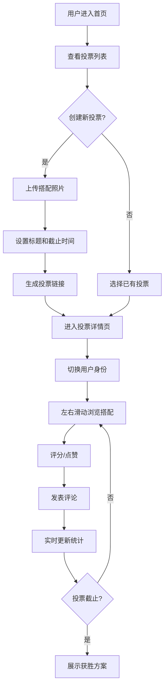

## 1. 产品概述

搭配投票应用是一款帮助用户解决日常穿搭选择困难的互动投票工具。用户可以上传多套搭配照片，创建投票链接，邀请朋友打分评论，最终根据实时统计结果选出最佳搭配。

- 核心价值：用社交投票的方式，让穿搭选择变得有趣且有参与感
- 目标用户：年轻时尚人群、穿搭爱好者、选择困难症用户
- 市场定位：轻量级社交互动工具，聚焦日常穿搭决策场景

## 2. 核心功能

### 2.1 用户角色

| 角色 | 说明 | 核心权限 |
|------|------|----------|
| 投票创建者 | 发起搭配投票的用户 | 创建投票、上传图片、查看结果、管理投票 |
| 投票参与者 | 受邀打分的朋友 | 浏览搭配、评分点赞、发表评论、查看实时结果 |

### 2.2 功能模块

1. **首页 / 投票列表**：展示进行中和已结束的投票，创建新投票入口
2. **创建投票**：上传搭配照片、设置标题、设置截止时间
3. **投票详情 / 打分页**：左右滑动浏览搭配、评分/点赞、留言评论
4. **结果统计页**：实时展示各搭配得票、评论列表、获胜方案
5. **用户切换**：本地模拟多个用户身份，体验完整投票流程

### 2.3 页面详情

| 页面名称 | 模块名称 | 功能描述 |
|----------|----------|----------|
| 首页 | 投票卡片列表 | 展示所有投票，显示状态标签（进行中/已结束），点击进入详情 |
| 首页 | 创建投票按钮 | 悬浮操作按钮，点击跳转到创建投票页 |
| 创建投票页 | 图片上传区 | 支持多图上传，预览缩略图，可删除重传 |
| 创建投票页 | 表单输入区 | 投票标题输入、截止时间选择 |
| 创建投票页 | 提交按钮 | 确认创建投票，生成投票链接 |
| 投票详情页 | 搭配卡片滑动 | 左右滑动切换不同搭配，支持手势滑动 |
| 投票详情页 | 评分操作 | 点赞按钮、星级评分、滑动评分 |
| 投票详情页 | 评论区 | 查看评论、发表评论、显示用户头像昵称 |
| 投票详情页 | 实时统计 | 实时显示各搭配得票数和百分比 |
| 投票详情页 | 用户切换 | 顶部切换当前用户身份，模拟多人投票 |
| 结果页 | 获胜展示 | 突出展示最高分搭配，显示胜利动效 |
| 结果页 | 排行榜 | 按得分排序展示所有搭配 |
| 结果页 | 评论墙 | 展示所有用户评论 |

## 3. 核心流程

用户从首页进入，可以查看已有投票或创建新投票。创建投票时上传多套搭配照片，设置标题和截止时间。投票创建后，参与者可以左右滑动浏览搭配，进行评分和留言。系统实时统计各搭配得票，截止后展示获胜方案和所有评论。

## 4. 用户界面设计

### 4.1 设计风格

- **设计方向**：高级时尚杂志风格，黑白为主色调，搭配酒红色作为点缀色
- **整体氛围**：简约、高级、有质感，像翻阅时尚杂志一样的体验
- **主色调**：纯黑 #000000，象牙白 #F5F1EB
- **点缀色**：酒红色 #8B2635，用于强调和交互元素
- **字体**：标题使用优雅衬线字体（Playfair Display），正文使用现代无衬线字体（Inter）
- **按钮风格**：极简风格，细边框或纯文字按钮，悬停时有微妙的颜色过渡
- **布局风格**：卡片式布局，大量留白，不对称构图
- **图标风格**：线性图标，简洁精致

### 4.2 页面设计概述

| 页面名称 | 模块名称 | UI 元素 |
|----------|----------|---------|
| 首页 | 投票卡片列表 | 杂志封面式卡片、悬停放大效果、状态标签、渐变遮罩 |
| 创建投票页 | 图片上传区 | 虚线边框上传区、拖拽上传、缩略图网格、删除按钮 |
| 创建投票页 | 表单区 | 下划线输入框、日期选择器、优雅的表单标签 |
| 投票详情页 | 搭配卡片 | 全屏卡片、左右滑动手势、阴影层次、毛玻璃效果 |
| 投票详情页 | 评分区 | 大号心形点赞按钮、星级评分、滑动评分条 |
| 投票详情页 | 评论区 | 聊天气泡样式、用户头像、时间戳 |
| 结果页 | 获胜展示 | 金色皇冠图标、放大动效、聚光灯光效 |
| 结果页 | 排行榜 | 排名数字、进度条、百分比显示 |

### 4.3 响应式设计

- **设计优先级**：移动端优先，桌面端适配
- **移动端**：单栏布局，卡片全屏展示，手势滑动优先
- **桌面端**：双栏布局，左侧搭配展示，右侧评论和统计
- **触摸优化**：增大点击热区，支持触摸滑动手势
- **断点**：移动端 < 768px，平板 768-1024px，桌面端 > 1024px

### 4.4 动效与交互

- **卡片滑动**：流畅的卡片切换动画，带有惯性滚动效果
- **点赞动画**：心形放大弹跳，粒子飘散效果
- **页面切换**：淡入淡出 + 轻微位移的过渡效果
- **加载动画**：优雅的旋转加载器，与整体风格统一
- **悬停效果**：微妙的缩放和阴影变化
- **获胜揭晓**：倒计时动效 + 聚光灯 + 皇冠出现动画
