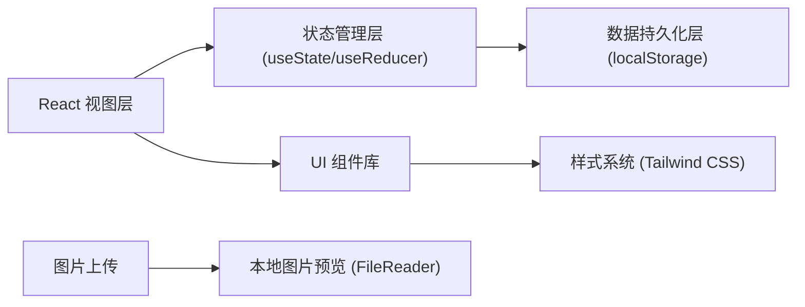
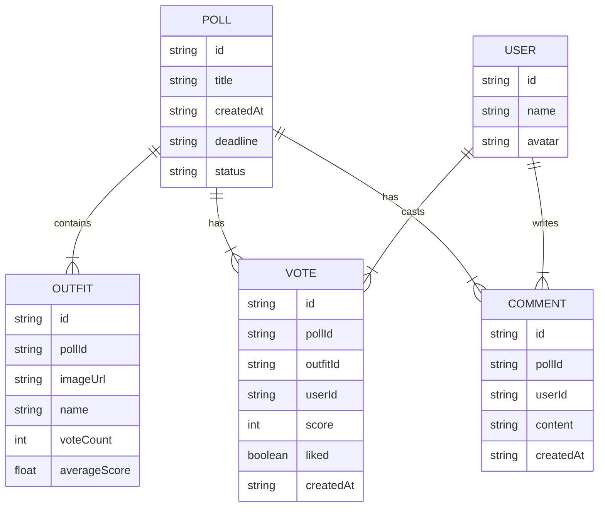

## 1. 架构设计

本应用为纯前端单页应用，数据存储在浏览器本地存储（localStorage）中，模拟后端服务。采用 React 组件化架构，使用状态管理实现数据的响应式更新。



## 2. 技术描述

- **前端框架**：React 18 + TypeScript
- **构建工具**：Vite
- **样式方案**：Tailwind CSS 3
- **路由管理**：React Router DOM 6
- **状态管理**：React Context + useReducer
- **数据持久化**：localStorage
- **图标库**：Lucide React
- **动画库**：Framer Motion
- **图片处理**：浏览器原生 FileReader API

## 3. 路由定义

| 路由 | 页面 | 功能描述 |
|------|------|----------|
| `/` | 首页 | 投票列表展示，创建投票入口 |
| `/create` | 创建投票页 | 上传图片、设置标题和截止时间 |
| `/vote/:id` | 投票详情页 | 浏览搭配、评分、评论、用户切换 |
| `/results/:id` | 结果页 | 获胜展示、排行榜、评论墙 |

## 4. 数据模型

### 4.1 数据模型定义



### 4.2 TypeScript 类型定义

```typescript
interface User {
  id: string;
  name: string;
  avatar: string;
}

interface Outfit {
  id: string;
  pollId: string;
  imageUrl: string;
  name: string;
  voteCount: number;
  averageScore: number;
}

interface Vote {
  id: string;
  pollId: string;
  outfitId: string;
  userId: string;
  score: number;
  liked: boolean;
  createdAt: string;
}

interface Comment {
  id: string;
  pollId: string;
  userId: string;
  content: string;
  createdAt: string;
}

interface Poll {
  id: string;
  title: string;
  createdAt: string;
  deadline: string;
  status: 'active' | 'ended';
  outfits: Outfit[];
  votes: Vote[];
  comments: Comment[];
}
```

## 5. 核心模块设计

### 5.1 组件结构

```
src/
├── components/
│   ├── common/
│   │   ├── Button.tsx
│   │   ├── Card.tsx
│   │   ├── Avatar.tsx
│   │   └── Input.tsx
│   ├── poll/
│   │   ├── PollCard.tsx
│   │   ├── PollList.tsx
│   │   └── CreatePollForm.tsx
│   ├── outfit/
│   │   ├── OutfitCard.tsx
│   │   ├── OutfitSwiper.tsx
│   │   └── RatingControls.tsx
│   ├── comment/
│   │   ├── CommentItem.tsx
│   │   └── CommentList.tsx
│   ├── results/
│   │   ├── WinnerDisplay.tsx
│   │   └── Leaderboard.tsx
│   └── user/
│       └── UserSwitcher.tsx
├── pages/
│   ├── HomePage.tsx
│   ├── CreatePollPage.tsx
│   ├── VotePage.tsx
│   └── ResultsPage.tsx
├── context/
│   ├── PollContext.tsx
│   └── UserContext.tsx
├── hooks/
│   ├── useLocalStorage.ts
│   └── useSwipe.ts
├── types/
│   └── index.ts
├── utils/
│   ├── mockData.ts
│   └── helpers.ts
└── App.tsx
```

### 5.2 状态管理

- **PollContext**: 管理投票数据、评论、得票统计
- **UserContext**: 管理当前用户身份、用户切换功能
- **useLocalStorage Hook**: 封装 localStorage 读写操作

### 5.3 核心功能实现

1. **图片上传**：使用 `input type="file"` + `FileReader` 实现本地预览
2. **滑动浏览**：自定义 `useSwipe` Hook 监听触摸/鼠标事件
3. **评分系统**：支持点赞和 1-5 星评分，实时计算平均分
4. **实时统计**：通过 Context 状态更新驱动 UI 响应式变化
5. **用户切换**：预置多个模拟用户，一键切换身份
6. **截止时间**：定时器检测投票状态，自动切换为已结束
